# Установка Cita Por Favor

## 1. Установите Tampermonkey

Откройте Chrome → меню «⋮» → «Расширения» → «Посетить магазин расширений
Chrome», найдите Tampermonkey — или сразу откройте
[Tampermonkey в Chrome Web Store](https://chromewebstore.google.com/detail/tampermonkey/dhdgffkkebhmkfjojejmpbldmpobfkfo).

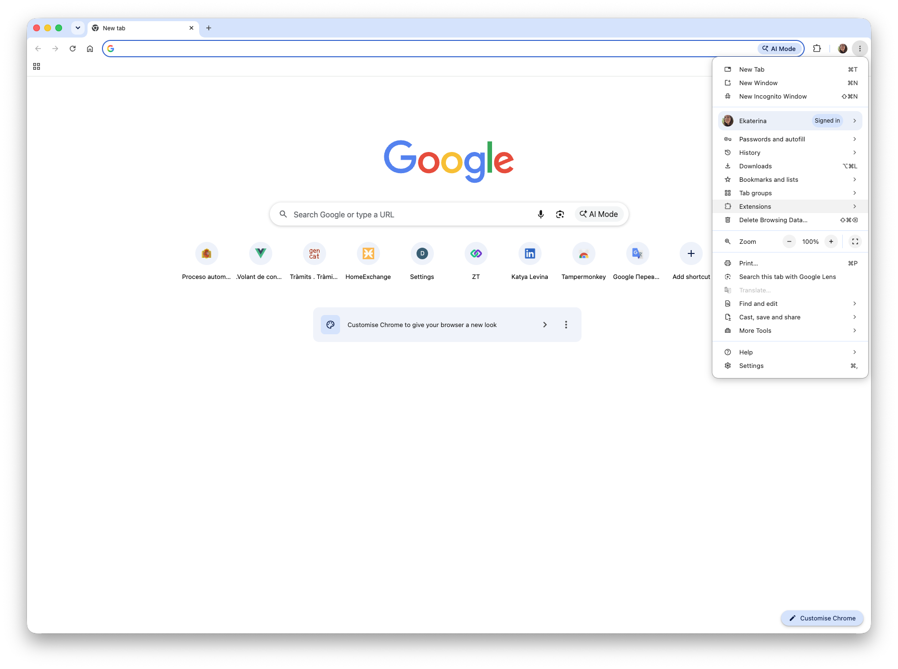

На странице Tampermonkey нажмите синюю кнопку **«Установить»** (Add to Chrome).

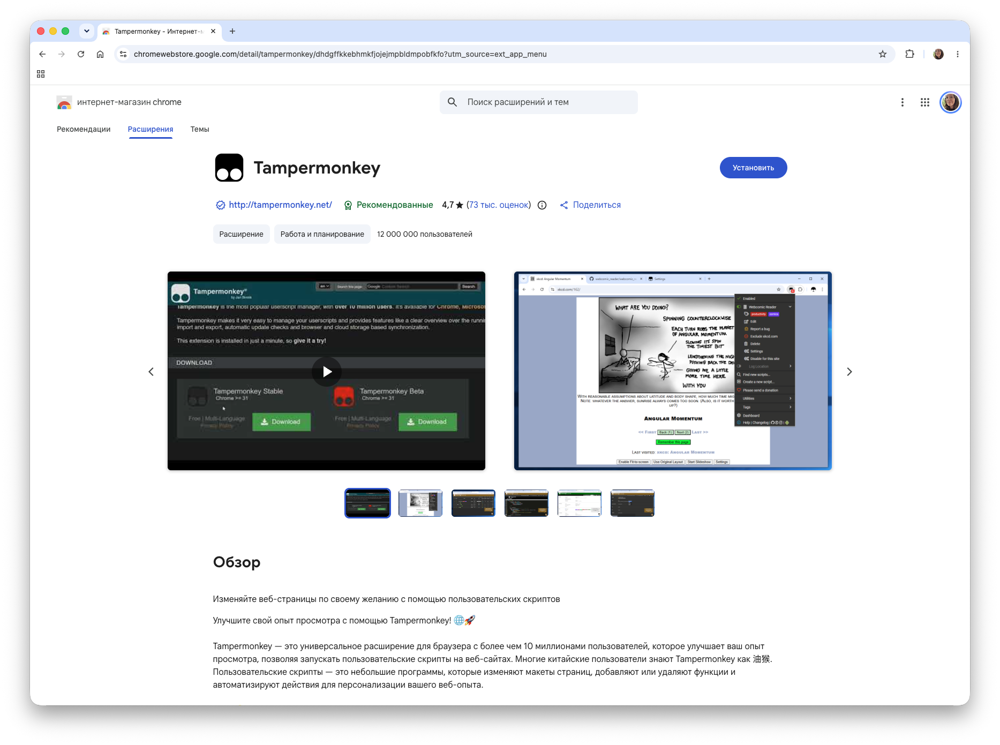

Chrome покажет окно подтверждения **«Add "Tampermonkey"?»** со списком
разрешений (читать и изменять данные сайтов, показывать уведомления,
обрабатывать буфер обмена). Нажмите **«Add extension»** («Добавить
расширение») — это стандартное окно для любого менеджера скриптов.

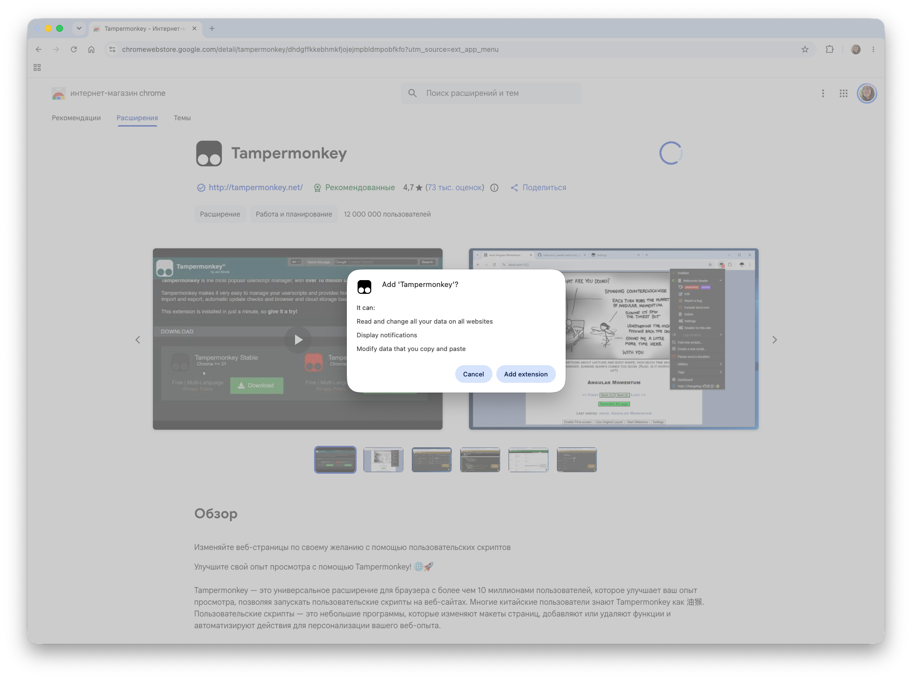

После установки Chrome сам открывает приветственную страницу
`tampermonkey.net` — она не нужна, просто закройте вкладку. Значок
Tampermonkey появится рядом с адресной строкой; если его не видно — нажмите
на значок пазла и закрепите Tampermonkey, нажав на булавку.

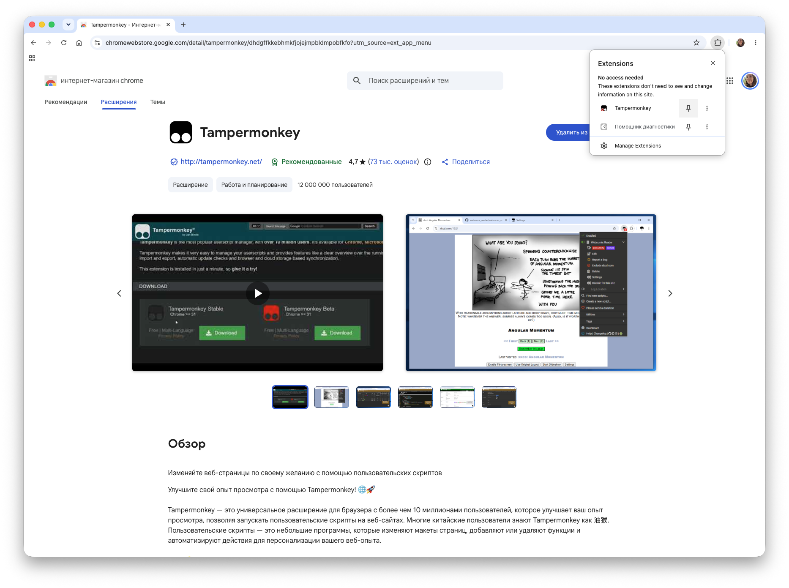

Быстрая проверка: нажмите на значок Tampermonkey — в меню должен быть пункт
**«Создать новый скрипт…» (Create a new script…)**.

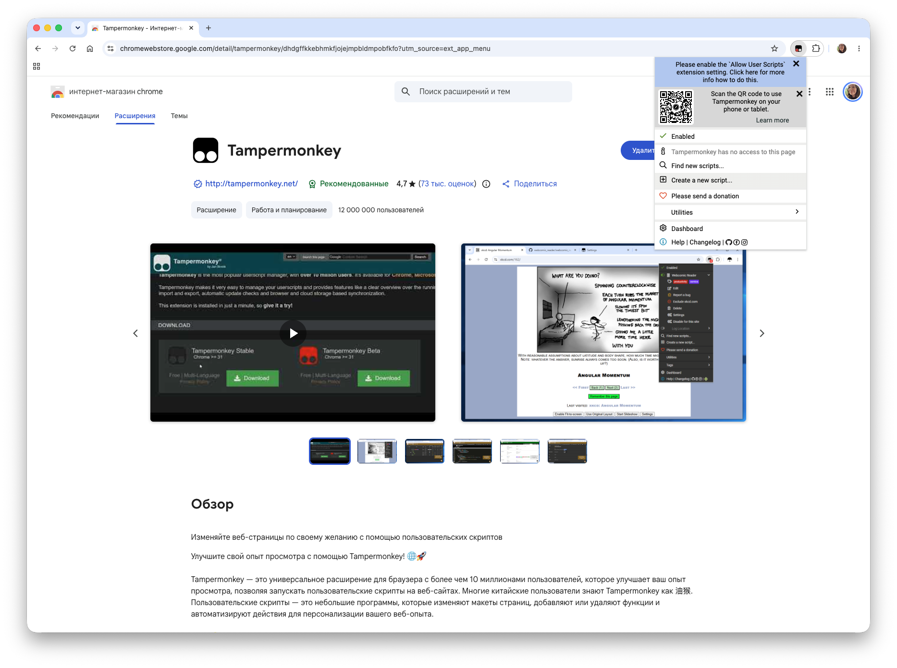

Если в меню Tampermonkey видно предупреждение **«Allow User Scripts»**, а
сверху страницы расширения — синяя плашка о том, что нужно разрешить
пользовательские скрипты, сделайте ещё один шаг: откройте
`chrome://extensions` → Tampermonkey → «Подробнее» и включите переключатель
**«Разрешить пользовательские скрипты» (Allow User Scripts)**. Без этого
Chrome не даст расширению запускать userscript'ы.

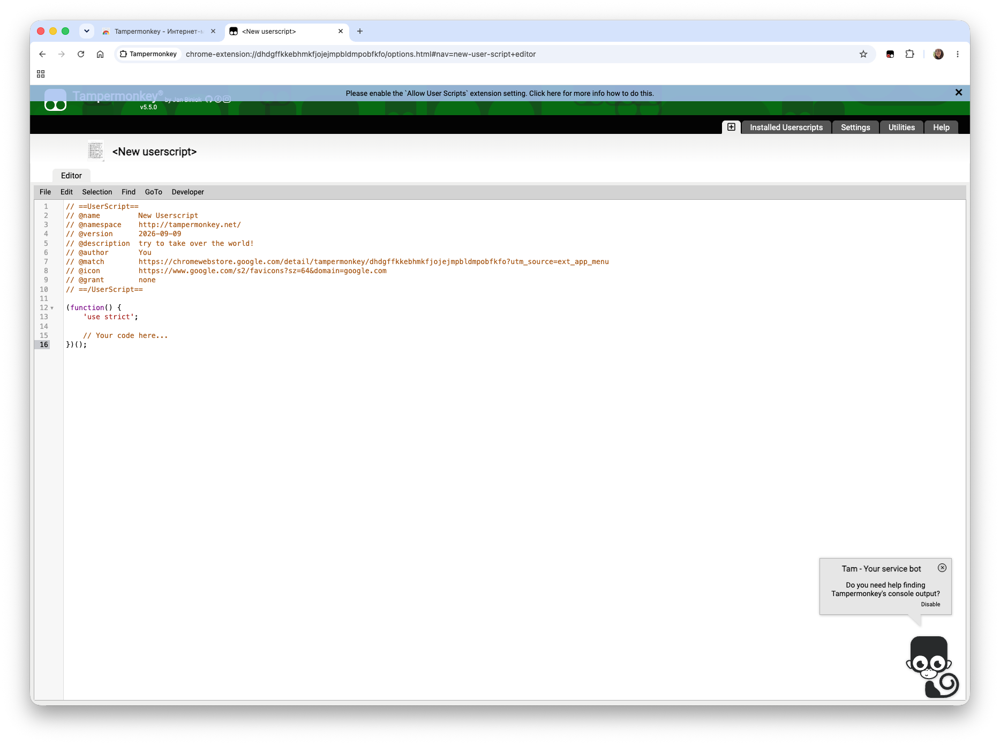

## 2. Скопируйте файл скрипта

В репозитории откройте файл
[`cita-autofill.user.js`](https://github.com/katilevina/cita-por-favor/blob/main/cita-autofill.user.js)
и нажмите кнопку **«Copy raw file»** справа над кодом — весь файл скопируется
в буфер обмена одним кликом. В первых строках файла видно имя Cita Por Favor
и текущую версию (`@version`); личных данных в коде нет — они вводятся позже
через панель скрипта.

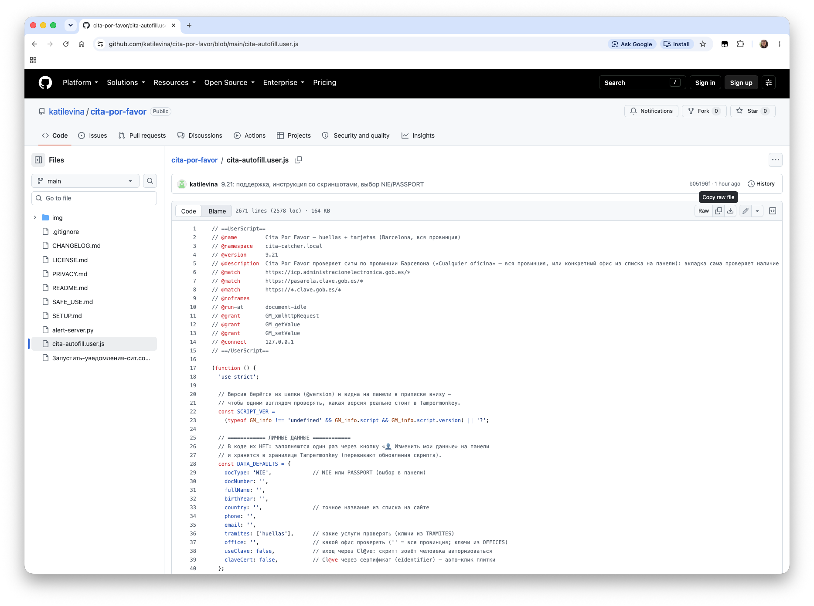

Если вы нажали «Raw» и видите сплошной код без оформления — так и должно
быть. Кнопка **«Copy raw file»** работает и на этой странице.

Скачивать репозиторий не нужно. Если удобнее иметь файл на диске — рядом
есть кнопка **«Download raw file»**, или **Code → Download ZIP** в репозитории;
в архиве нужен только `cita-autofill.user.js`.

## 3. Добавьте userscript

1. Откройте Tampermonkey → «Создать новый скрипт».
2. Удалите шаблонный текст.
3. Вставьте скопированный на предыдущем шаге код и сохраните
   (Cmd+S / Ctrl+S).

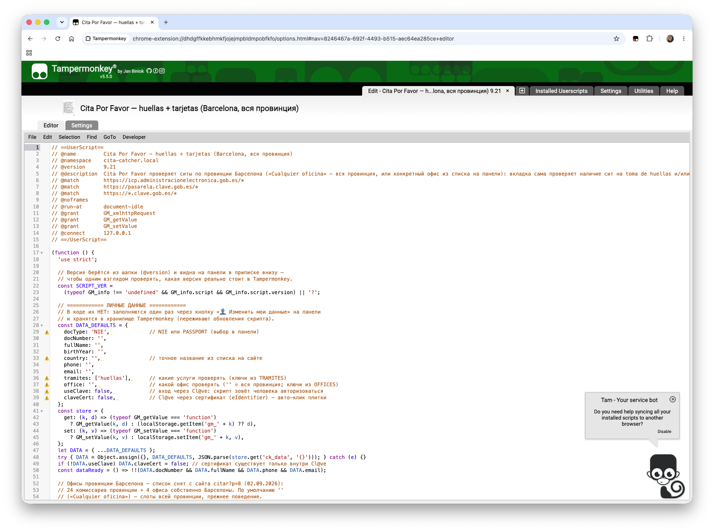

После сохранения скрипт появляется в списке Tampermonkey включённым —
вкладка без звёздочки, переключатель активен.

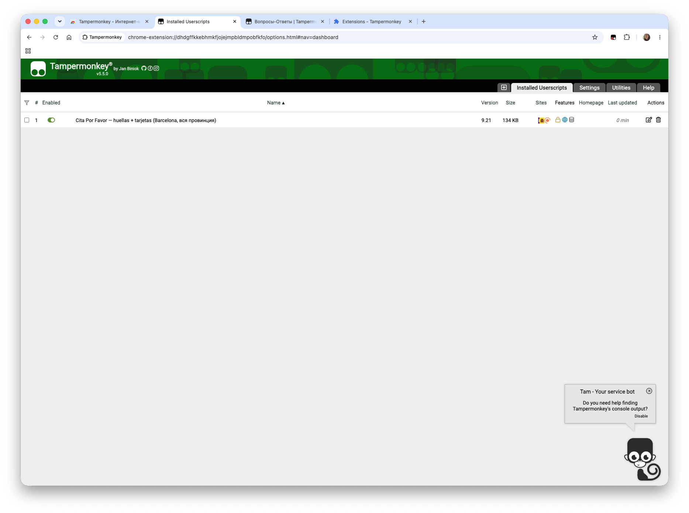
4. Откройте [страницу записи](https://icp.administracionelectronica.gob.es/icpplustieb/citar?p=8)
   на сайте администрации. Внизу справа появится панель Cita Por Favor.

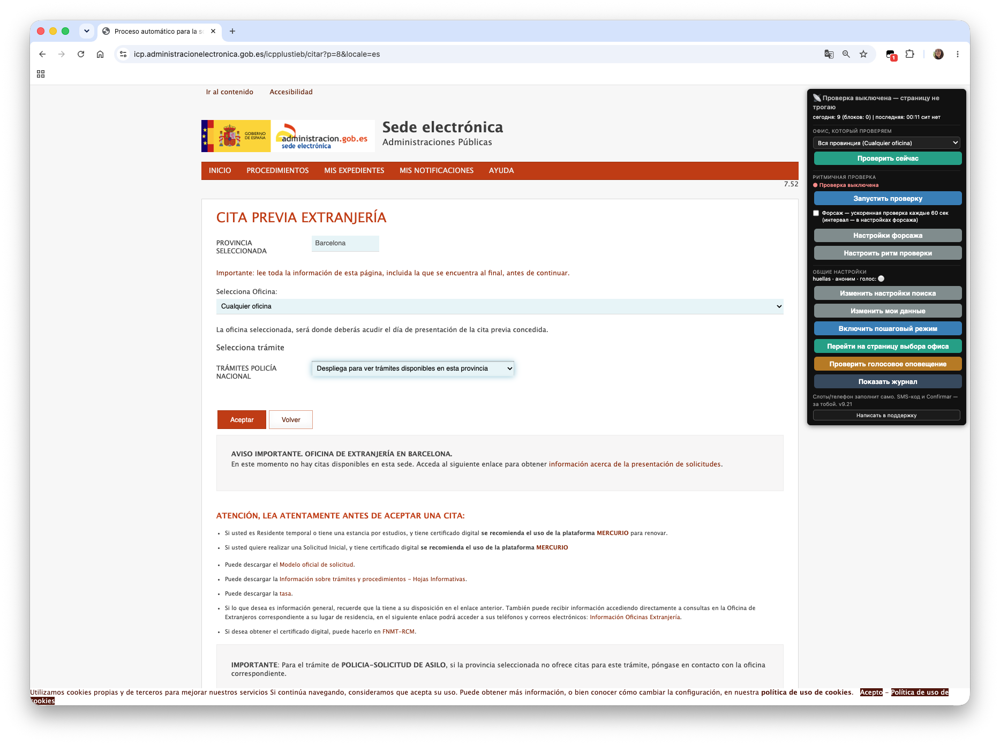

## 4. Настройте проверку

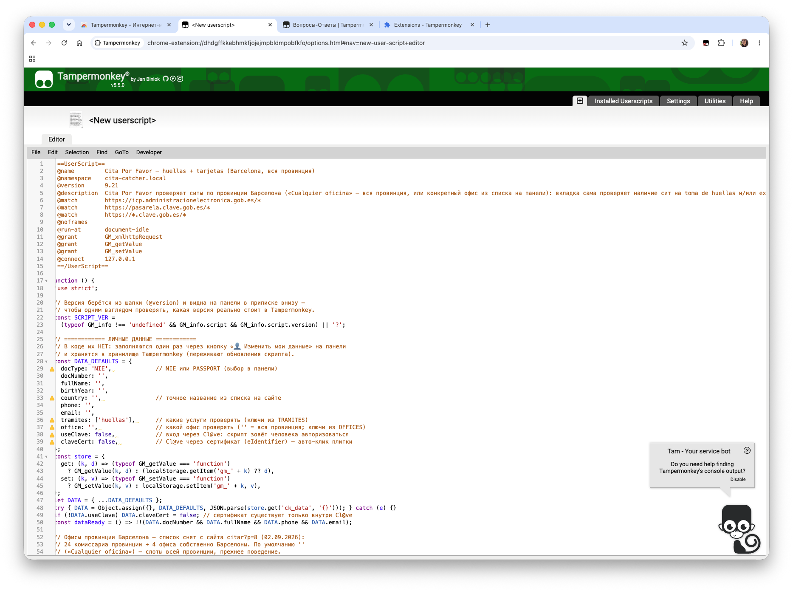

Перед первой проверкой нажмите **«Изменить мои данные»** и заполните свои
данные — они сохраняются в Tampermonkey только в вашем браузере. Затем
нажмите **«Проверить сейчас»**: скрипт сделает одну проверку без сертификата,
и вы увидите, как он работает. А если хотите посмотреть ещё медленнее и
управлять каждым шагом — включите **«Включить пошаговый режим»**: скрипт
делает один шаг и ждёт вашего решения на каждом экране.

В «Настройках поиска» рекомендуем войти **через Cl@ve с сертификатом**
(«Сертификатом в Chrome (eIdentifier)»): сертификат живёт дольше обычного
входа Cl@ve и реже требует вашего присутствия. Администрация сама
рекомендует identificarse через Cl@ve, а не заходить анонимно.

Основные элементы панели:

- **«Запустить проверку»** — запускает ритмичную проверку по заданным
  интервалам. По умолчанию стоят рекомендованные интервалы, но их можно
  менять.
- **«Форсаж»** — режим, который игнорирует интервалы и проверяет ситы очень
  быстро (от 10 секунд). Это ручной инструмент на случай подозрения, что
  ситы появились прямо сейчас; не держите его включённым постоянно.
- **«Проверить голосовое оповещение»** — нужна, если вы решите включить
  голосовые уведомления из следующего раздела.
- **Журнал** — сводка за день: сколько было проверок и чем каждая закончилась.

Не запускайте одну и ту же проверку одновременно в нескольких вкладках или
на нескольких компьютерах.

## 5. Пусть компьютер сам вас позовёт (macOS)

Запустите `Запустить-уведомления-сит.command` двойным кликом — и когда ситы
найдутся, компьютер сам подзовёт вас голосом и системным уведомлением. Можно
заниматься своими делами и не смотреть на вкладку: панель продолжит
проверку, а голос позовёт именно в нужный момент.

Бонус — локальный `journal.log`, полная история проверок с снимками найденных
страниц в `snaps/`. Если захотите обратиться в поддержку, журнал поможет
точно описать, что происходило.

Окно Terminal, которое откроется при запуске, должно оставаться открытым,
пока нужна проверка. Команда использует только встроенный в macOS Python и
работает локально.

На Windows и Linux userscript работает и без этой команды — ситы найдутся и
на экране, просто без голоса macOS и локального журнала.

## Если панель не появилась

Проверьте, что Tampermonkey включён, скрипт сохранён без ошибок, а открытая
страница относится к сайту записи. После изменения скрипта обновите страницу.

## Нужна помощь

Для общего вопроса или отзыва откройте [GitHub Discussions](https://github.com/katilevina/cita-por-favor/discussions).
Для личной помощи нажмите «Написать в поддержку» в самом низу чёрной панели.
Не публикуйте и не отправляйте NIE, паспортные данные, телефон, e-mail,
SMS-код, пароль, сертификат, полный журнал или HTML-снимок страницы.
